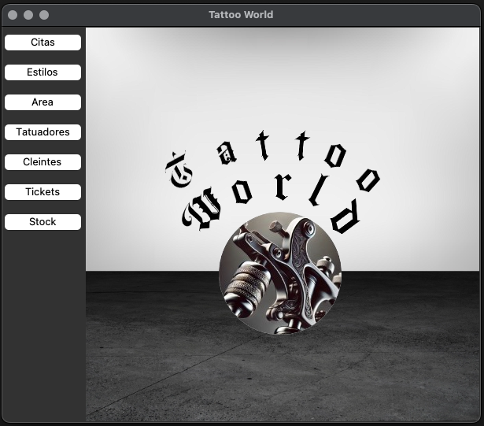

# TattooWorld

This Python application, utilizing Tkinter for the GUI and SQLite as the database, serves as a comprehensive management tool for tattoo parlors. It allows for the creation, reading, updating, and deletion (CRUD) of customer , appointment schedules, and other relevant data.

## Screenshots 

## Authors

- [@luisgh28](https://github.com/LuisGH28)

## Feedback

If you have any feedback, please reach out to us at luisgnzhdz@gmail.com
